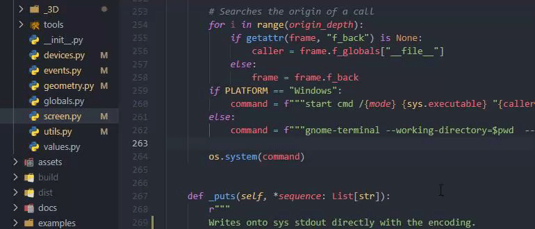
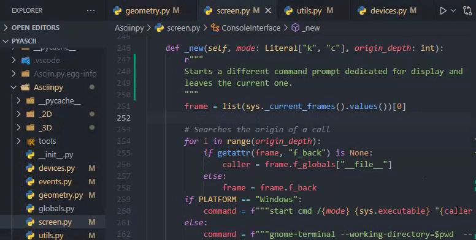
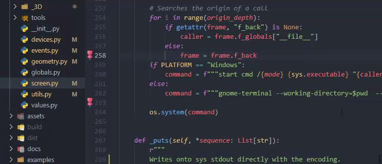
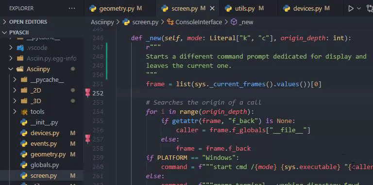
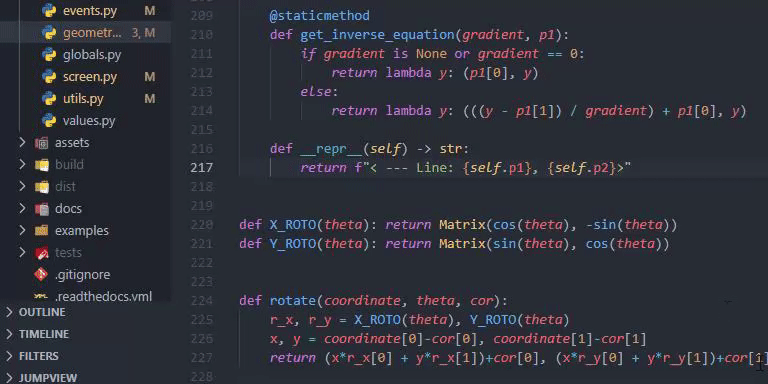
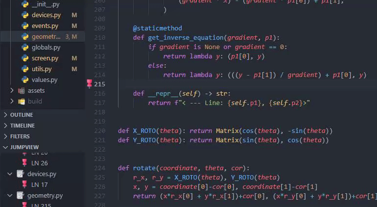
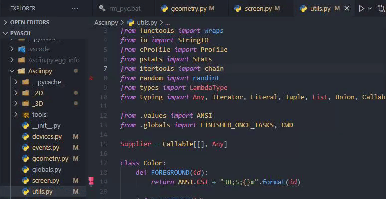

# Code Jumper

Code Jumper is a simple tool to set up markers in source code to restore focus on demand and other utility navigation addons. As with working on different class files for **Java**, header and source files for **C++**, different modules in **Python** navigating through the dense nature of code bases can become overwhelming, tedious and repetitive very quickly. Often times there are cases where various snippets from different file locations are coupled in logic, Code Jumper will help get to pre-determined location in code that has manually been saved.

------

**[Support Server](https://discord.gg/UmnzdPgn6g)** | **[Issues](https://github.com/Rickaym/Code-Jumper/issues)** | **[Repository](https://github.com/Rickaym/Code-Jumper)** | **[Install here](https://marketplace.visualstudio.com/items?itemName=Rickaym.code-jumper)**

------

## Features

* [New JumpPoint](#new-jumppoint)
* [Delete Jump Point](#delete-jumppoint)
* [Tree View](#tree-view)
* [Jump To](#jump-to)

### New JumpPoint
There are two ways you can setup a jump point; through a key-binding and the command.

* Key-Bind `ctrl + l`

Press the keybind to set a jump point to the current line of the cursor.
> 

After pressing the key-bind, you will notice a pushpin gutter indicator appearing in the side. This confirms that you have successfully pinned the point!

* Command  `New JumpPoint`

Press `F1` type in either the name or the indicator and press `enter`.

> 

### Delete JumpPoint
You can delete a jump point through a key-bind, a command or through the tree view.

* Key-bind `ctrl + '`

Press the keybind to remove the jump point from the current line of the cursor.

> 

* Command  `Delete JumpPoint`

Press `F1` type in either the name or the indicator and press `enter` to remove the jump point from the current line of the cursor.

> 

### Tree View

Code Jumper provides a tree view inside the `Explorer` to monitor all the jump points saved.

> 

### Jump To

Jumping to designations is supported through the tree view by clicking and through a command so far.

> 

> 

## Requirements

There are no extra requirements.

## Extension Settings

Code-Jumper contributes the following settings:

* `code-jumper.newJumpPoint`: Sets a jump point at the current curser location
* `code-jumper.deleteJumpPoint`: Jumps to a given jump point
* `code-jumper.jumpTo`: Jumps to a given jump point
* `code-jumper.refreshJumpPoints`: Refreshes the jump view tree

## Known Issues

~ None.

## Release Notes

### 1.0.0

Initial release of Code Jumper

### Attributions and Credits

Icons from <a href="https://www.flaticon.com/" title="Flaticon">www.flaticon.com</a>
