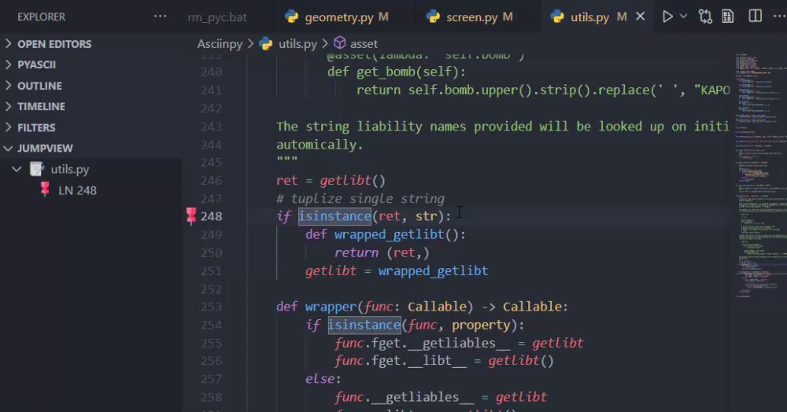

# Code Jumper

Code Jumper is a simple tool to set up markers in source code to restore focus on demand and other utility navigation addons. As with working on different class files for **Java**, header and source files for **C++**, different modules in **Python** navigating through the dense nature of code bases can become overwhelming, tedious and repetitive very quickly. Often times there are cases where various snippets from different file locations are coupled in logic, Code Jumper will help get to pre-determined location in code that has manually been saved.

------

**[Support Server](https://discord.gg/UmnzdPgn6g)** | **[Issues](https://github.com/Rickaym/Code-Jumper/issues)** | **[Repository](https://github.com/Rickaym/Code-Jumper)** | **[Install here](https://marketplace.visualstudio.com/items?itemName=Rickaym.code-jumper)**

------

## Features

* **[New JumpPoint](#new-jumppoint)**
  - [Keybind](#new-jp-normal)
  - [Quick Jump](#new-jp-quick)
  - [Command](#new-jp-command)
* **[Delete Jump Point](#delete-jumppoint)**
  - [Keybind](#del-jp-keybind)
  - [Command](#del-jp-command)
* **[Tree View](#tree-view)**
* **[Jump To](#jump-to)**

### New JumpPoint
There are two ways you can setup a jump point; through a key-binding and the command.

<h4 id="new-jp-normal">Key-Bind</h4>

> `ctrl + shift + l`

Pressing the keybind sets a jump point to the current line of the cursor without a quick jump binding. After successfully setting the key-bind, you will notice a pushpin gutter indicator appearing in the side. This confirms that you have successfully pinned the point!

<h4 id="new-jp-quick">Quick Jump Binding</h4>

> `ctrl + alt + l`

A quick jump binding is a key binding to restore focus to a specific jump point. Jump points made using [this](new-jp-normal) or the command have no defined quick jump binding. (this is described by the letter beside the jump point as visible in the tree view).

You can make a new jump point with a definable binding by using `ctrl + alt + l`. This will make a new jump point and provide you a prompt to define the binding.

To set a quick jump binding to pre-existing jump points, you can place the cursor on the target line and use `ctrl + alt +l`. You can only type characters `a` to `z` as the quick jump binding. This is used as a key-chord with `ctrl + l`.

E.g. If you had set the quick jump binding as `a`, you would use it by pressing `ctrl + l`, release, and then press `a`.

<h4 id="new-jp-command">Command</h4>

Press `F1` type in either the name or the indicator and press `enter`.

### Delete JumpPoint
You can delete a jump point through the same key-bind as creating a new with the cursor on the line of the target jump point.

<h4 id="del-jp-keybind">Key-bind</h4>

> `ctrl + shift + l`

Press the keybind to remove the jump point from the current line of the cursor.

<h4 id="del-jp-command">Command</h4>

Press `F1` type in either the name or the indicator and press `enter` to remove the jump point from the current line of the cursor.

### Tree View

Code Jumper provides a tree view inside the `Explorer` to monitor all the jump points saved.

### Jump To

Jumping to designations is supported through the tree view by clicking and through a command so far.

Last but not least, use the quick jump binding by pressing `ctrl + l`, release, and then press the saved quick jump binding.

## Requirements

There are no extra requirements.

## Extension Settings

Code-Jumper contributes the following settings:

* `code-jumper.newJumpPoint`: Sets a jump point at the current curser location
* `code-jumper.deleteJumpPoint`: Jumps to a given jump point
* `code-jumper.bindJumpPoint`: Binds a shortcut to a given jump point
* `code-jumper.jumpTo`: Jumps to a given jump point
* `code-jumper.refreshJumpPoints`: Refreshes the jump view tree

## Known Issues

~ None.

## Release Notes

- Added Quick Jump Keybinds
- Fixed problem with filenames

### Attributions and Credits

Icons from <a href="https://www.flaticon.com/" title="Flaticon">www.flaticon.com</a>
